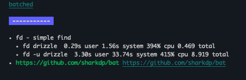

# gitfs

A wrapper around [go-git](https://github.com/go-git/go-git), compatible with the [fs.FS and fs.StatFS](https://pkg.go.dev/io/fs#FS) from the standard library.
package.

## Usage

```go
package main

import (
	"fmt"
	"github.com/magnuswahlstrand/gitfs"
	"io/fs"
	"log"
)

func main() {
	gitFS, err := gitfs.New("../local-repo")
	if err != nil {
		log.Fatalf("failed to setup repository: %s", err)
	}

	err = fs.WalkDir(gitFS, ".", func(path string, d fs.DirEntry, err error) error {
		if err != nil {
			log.Fatal(err)
		}
		fmt.Println(path)
		return nil
	})
	if err != nil {
		log.Fatalf("failed to walk dir: %s\n", err)
	}
}

```

## Examples

See [./examples](./examples).

#### Basic (same as above)

```
go run ./examples/basic
```

Output:

```
.
.air.toml
.gitignore
LICENSE
README.md
examples
examples/basic
examples/basic/go.mod
examples/basic/go.sum
examples/basic/main.go
...

...
go.work
go.work.sum
```

#### Output markdown

Traverses a git repo and outputs the markdown in a nice way to the terminal.

```
go run ./examples/markdown-directory -repo https://github.com/magnuswahlstrand/til.git -path /src/pages/blog
```

Output:

